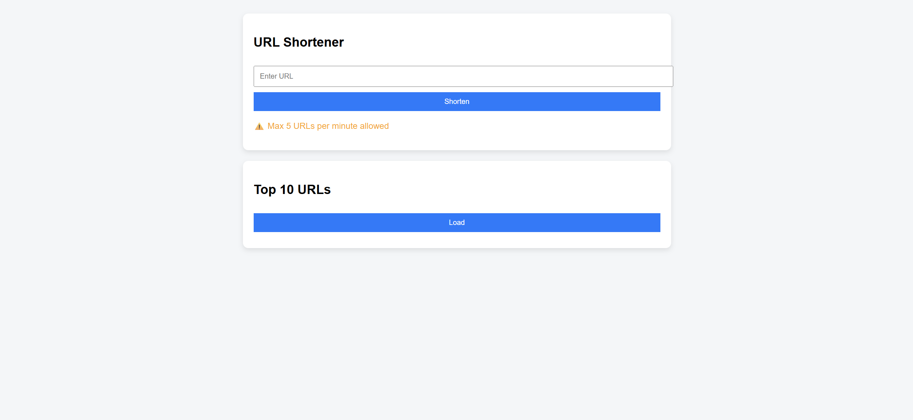
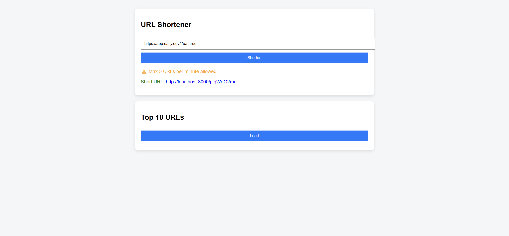
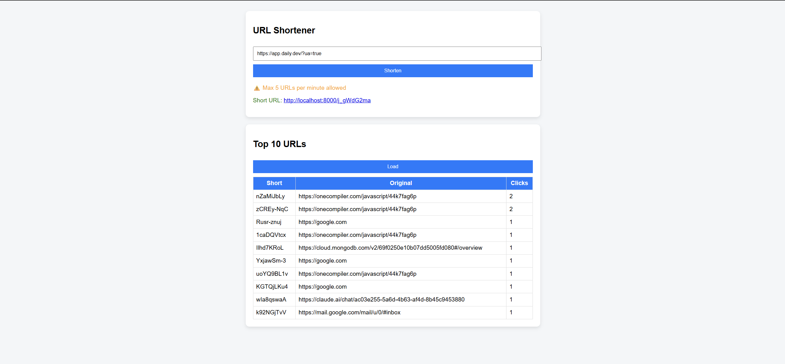
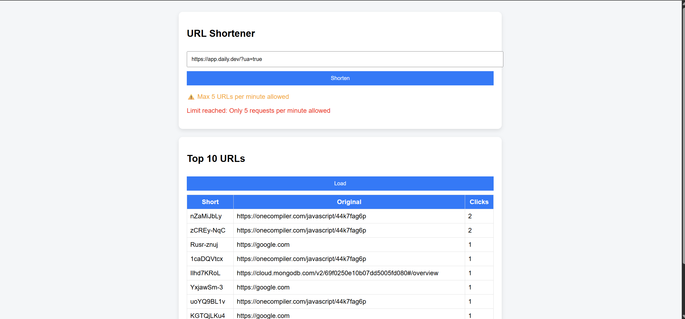

I built a URL shortener using Node.js and MongoDB. 
It supports URL generation, redirection, click tracking, and includes rate limiting for security.
I also implemented a feature to display the top 10 most accessed URLs.

## 📸 Screenshots

